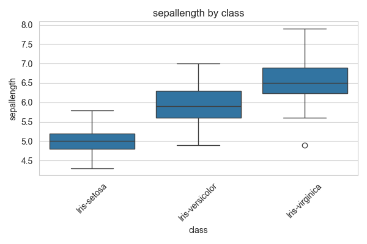
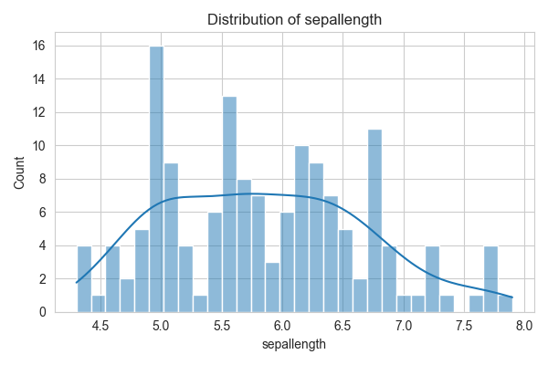
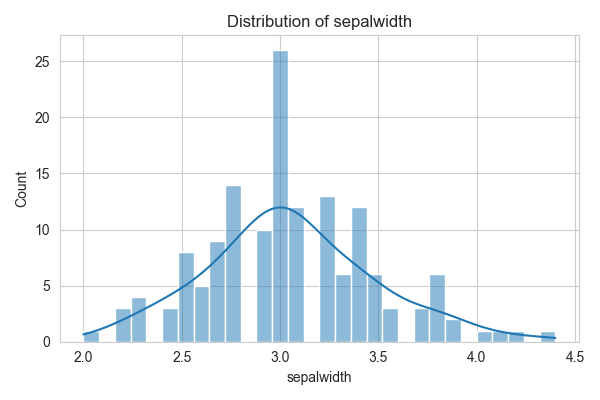

# Exploratory Data Analysis Report

## Dataset Overview
- Number of rows: 150
- Number of columns: 5

## Summary Statistics
### Numerical Features
|             |   count |    mean |   median |      std |   min |   max |      skew |   kurtosis |
|:------------|--------:|--------:|---------:|---------:|------:|------:|----------:|-----------:|
| sepallength |     150 | 5.84333 |     5.8  | 0.828066 |   4.3 |   7.9 |  0.311753 |  -0.573568 |
| sepalwidth  |     150 | 3.054   |     3    | 0.433594 |   2   |   4.4 |  0.330703 |   0.241443 |
| petallength |     150 | 3.75867 |     4.35 | 1.76442  |   1   |   6.9 | -0.271712 |  -1.39536  |
| petalwidth  |     150 | 1.19867 |     1.3  | 0.763161 |   0.1 |   2.5 | -0.103944 |  -1.33525  |

### Categorical Features
|       |   unique_count |   mode_freq |   missing |
|:------|---------------:|------------:|----------:|
| class |              3 |          50 |         0 |

## Key Insights
- Feature 'sepalwidth' has 4 potential outliers.
- Features 'sepallength' and 'petallength' have strong correlation: 0.87
- Features 'sepallength' and 'petalwidth' have strong correlation: 0.82
- Features 'petallength' and 'petalwidth' have strong correlation: 0.96
- Features with high variance: petallength

## Visualizations

