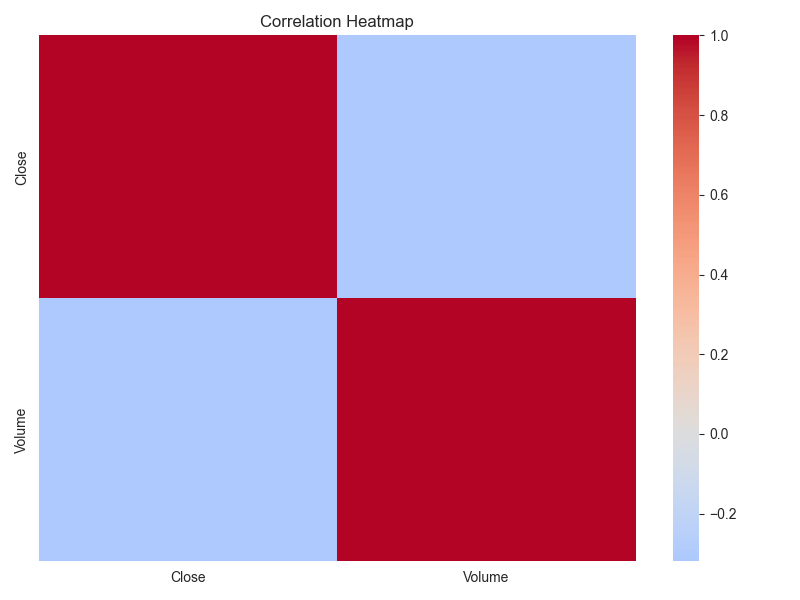
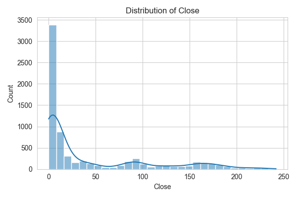
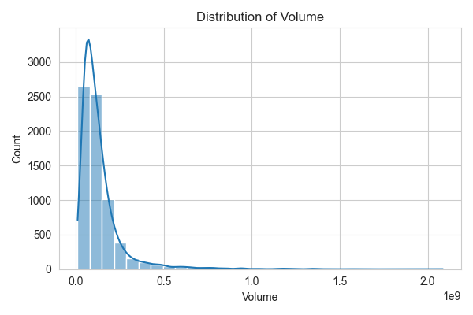

# Universal Analyst Model Report

**Date of Analysis:** 2025-08-15 22:16:56

**Dataset:** Amazon_stock_data

## Step 1: Dataset Overview
- original_shape: (7093, 6)
- final_shape: (7093, 3)
- constant_columns_removed: []
- highly_correlated_columns_removed: ['High', 'Low', 'Open']
- columns_dropped_missing: []
- column_types: {'Date': 'id-like', 'Close': 'numerical', 'Volume': 'numerical'}
- pca_applied: False

## Step 2: Exploratory Data Analysis (EDA)
# Exploratory Data Analysis Report

## Dataset Overview
- Number of rows: 7093
- Number of columns: 3

## Summary Statistics
### Numerical Features
|        |   count |         mean |    median |          std |       min |           max |    skew |   kurtosis |
|:-------|--------:|-------------:|----------:|-------------:|----------:|--------------:|--------:|-----------:|
| Close  |    7093 | 43.1151      | 9.2645    | 60.9995      | 0.069792  | 242.06        | 1.39392 |    0.62552 |
| Volume |    7093 |  1.34724e+08 | 9.936e+07 |  1.36989e+08 | 9.744e+06 |   2.08658e+09 | 4.7065  |   34.8444  |

### Categorical Features
|      |   unique_count |   mode_freq |   missing |
|:-----|---------------:|------------:|----------:|
| Date |           7093 |           1 |         0 |

## Key Insights
- Feature 'Close' has 147 potential outliers.
- Feature 'Volume' has 478 potential outliers.
- Features with high variance: Volume

## Visualizations

## Step 3: Insight Extraction
# Data Insight Report

## Dataset Summary
- Number of rows: 7093
- Number of columns: 3
- Target column: None
- Problem type: clustering

## Top Influential Features
No influential features identified or no target column.

## Summary Statistics of Top Features
No summary statistics available.

## Outlier Counts per Numeric Feature
- Close: 147 outliers detected
- Volume: 478 outliers detected

## Next Steps
- Consider clustering or unsupervised learning techniques.

## Conclusion
This report summarizes the data ingestion, preprocessing, exploratory analysis, insights, and modeling results.
Further analysis and model tuning may be required based on business needs.
