# Universal Analyst Model Report

**Date of Analysis:** 2025-08-16 01:14:06

**Dataset:** Coffe_sales

## Step 1: Dataset Overview
- info: Metadata from preprocessing step

## Step 2: Exploratory Data Analysis (EDA)
# Exploratory Data Analysis Report

## Dataset Overview
- Number of rows: 3636
- Number of columns: 12

## Summary Statistics
### Numerical Features
|             |   count |     mean |   median |     std |   min |   max |       skew |   kurtosis |
|:------------|--------:|---------:|---------:|--------:|------:|------:|-----------:|-----------:|
| hour_of_day |    3636 | 14.1669  |    14    | 4.22775 |  6    |    22 |  0.131124  |  -1.12408  |
| money       |    3636 | 31.7469  |    32.82 | 4.91993 | 18.12 |    40 | -0.523038  |  -0.661143 |
| Weekdaysort |    3636 |  3.84791 |     4    | 1.97598 |  1    |     7 |  0.0809382 |  -1.22873  |
| Monthsort   |    3636 |  6.39466 |     6    | 3.48069 |  1    |    12 |  0.0437939 |  -1.37446  |

### Categorical Features
|             |   unique_count |   mode_freq |   missing |
|:------------|---------------:|------------:|----------:|
| cash_type   |              2 |        3547 |         0 |
| card        |           1316 |         129 |        89 |
| coffee_name |              8 |         824 |         0 |
| Time_of_Day |              3 |        1231 |         0 |
| Weekday     |              7 |         585 |         0 |
| Month_name  |             12 |         525 |         0 |

## Key Insights
- Categorical feature 'cash_type' is highly imbalanced (dominant class > 90%).
- Features with high variance: money
- Datetime feature 'date' is monotonic increasing.
- Datetime feature 'datetime' is monotonic increasing.

## Visualizations
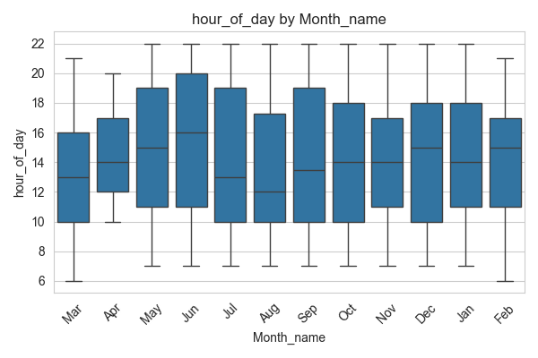
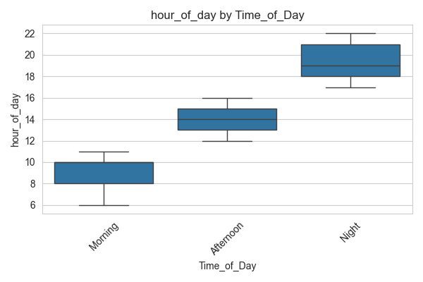
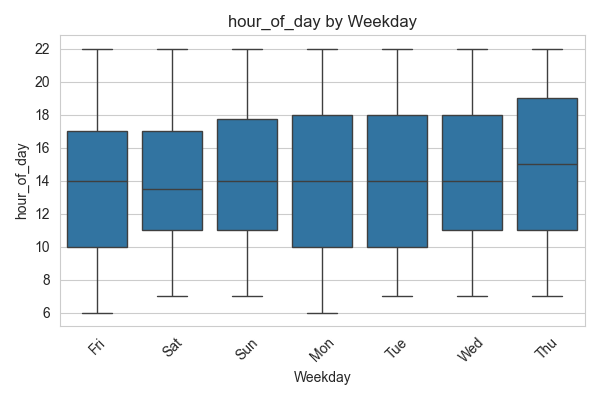
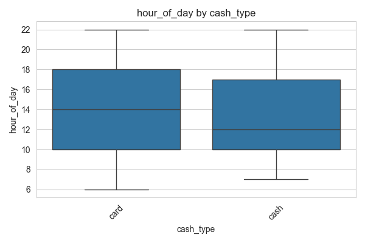
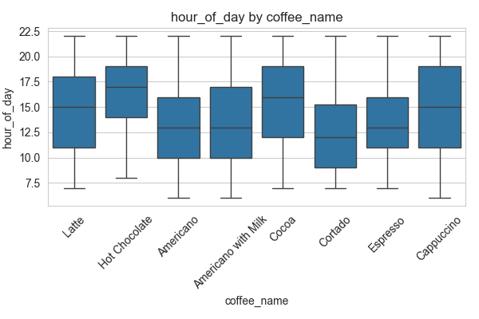
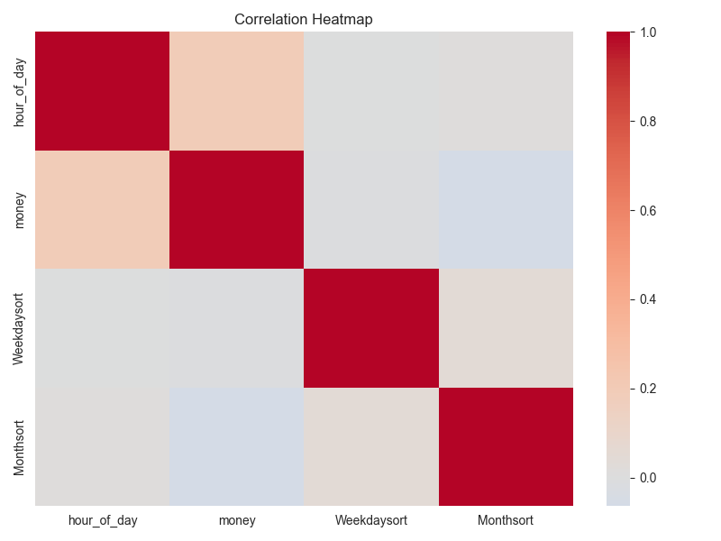
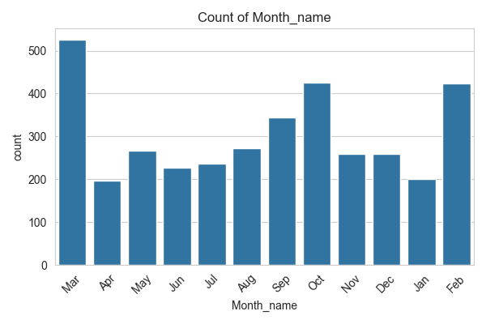
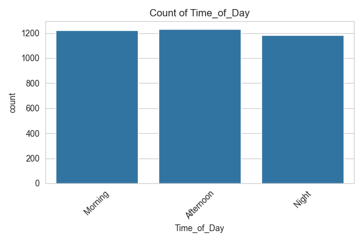
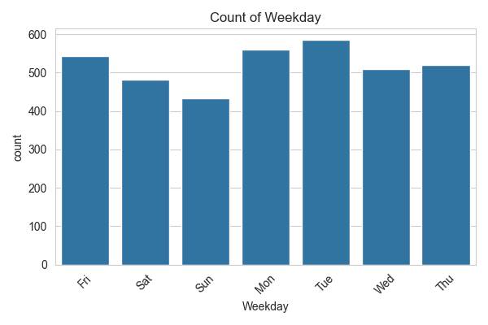
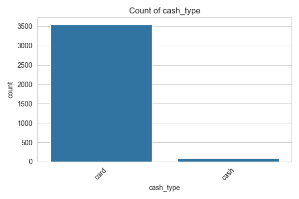
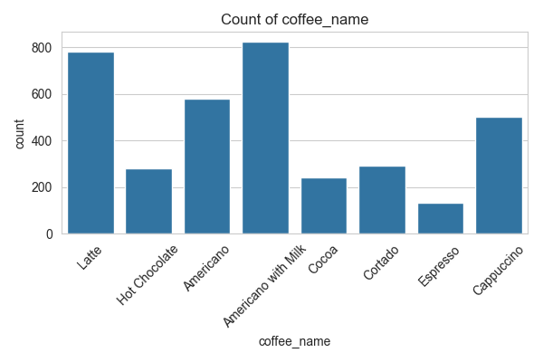
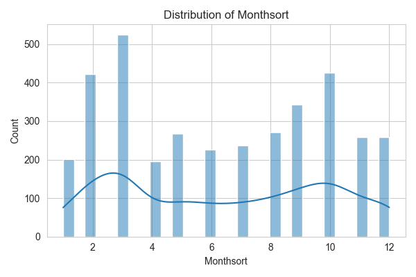
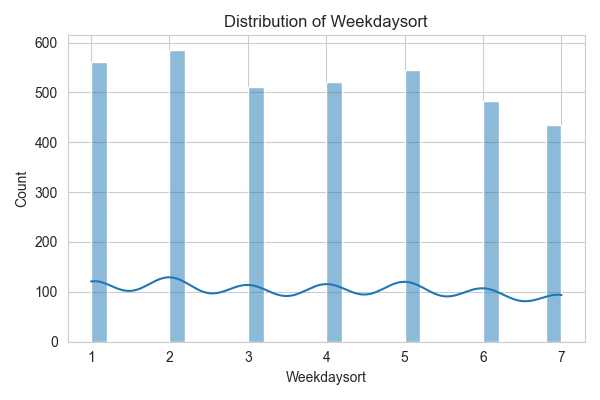
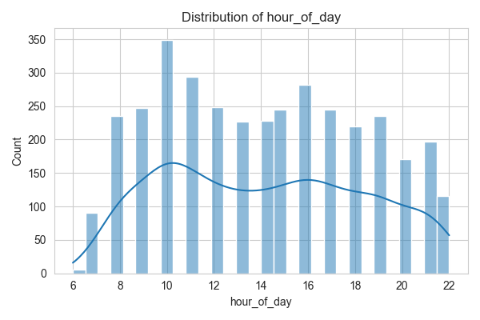
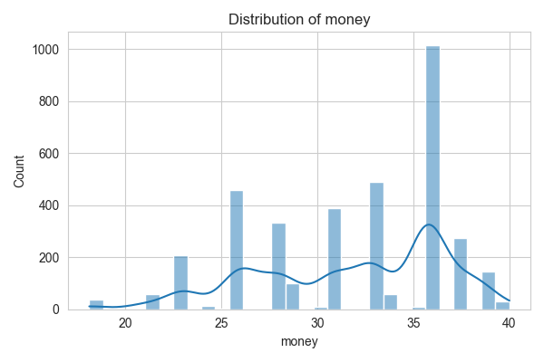
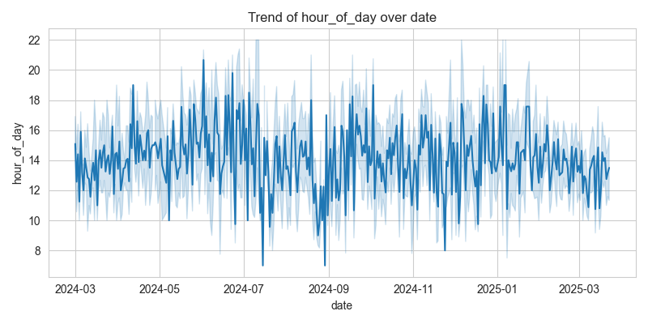

## Step 3: Insight Extraction
# Data Insight Report

## Dataset Summary
- Number of rows: 3636
- Number of columns: 12
- Target column: Monthsort
- Problem type: classification

## Top Influential Features
- money: Mutual Information Score = 0.8507
- Month_name_Mar: Mutual Information Score = 0.4163
- Month_name_Oct: Mutual Information Score = 0.3656
- Month_name_Feb: Mutual Information Score = 0.3514
- Month_name_Sep: Mutual Information Score = 0.3329
- Month_name_Aug: Mutual Information Score = 0.2765
- Month_name_May: Mutual Information Score = 0.2648
- Month_name_Nov: Mutual Information Score = 0.2549
- Month_name_Dec: Mutual Information Score = 0.2500
- Month_name_Jul: Mutual Information Score = 0.2361

## Summary Statistics of Top Features
- money: Mean = 31.7469, Median = 32.8200, Std = 4.9199

## Outlier Counts per Numeric Feature
- hour_of_day: 0 outliers detected
- money: 0 outliers detected
- Weekdaysort: 0 outliers detected
- Monthsort: 0 outliers detected

## Next Steps
- Consider building predictive models using the identified influential features.

## Step 4: Modeling and Prediction
# Model Evaluation Report

Problem type: classification

## LogisticRegression
- accuracy: 1.0000
- precision: 1.0000
- recall: 1.0000
- f1_score: 1.0000
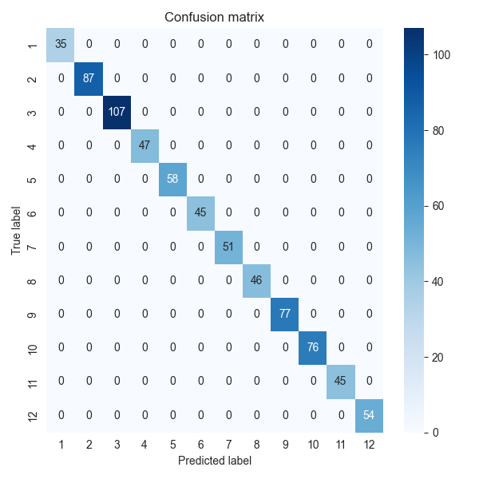

## RandomForestClassifier
- accuracy: 1.0000
- precision: 1.0000
- recall: 1.0000
- f1_score: 1.0000

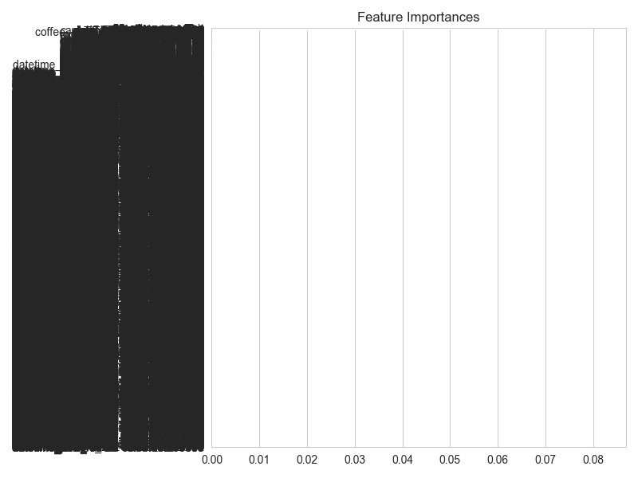

## SVC
- accuracy: 0.4258
- precision: 0.2913
- recall: 0.4258
- f1_score: 0.3208
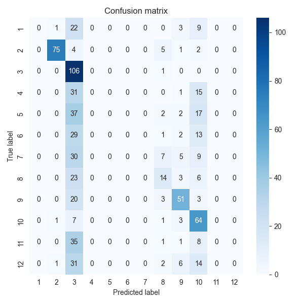

## Conclusion
This report summarizes the data ingestion, preprocessing, exploratory analysis, insights, and modeling results.
Further analysis and model tuning may be required based on business needs.
