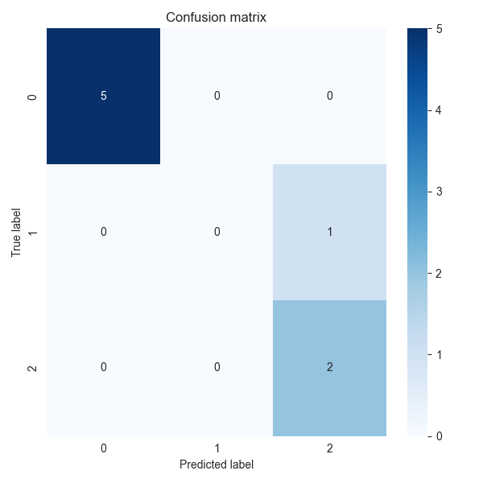
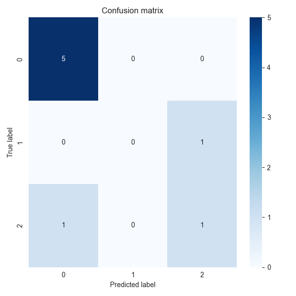
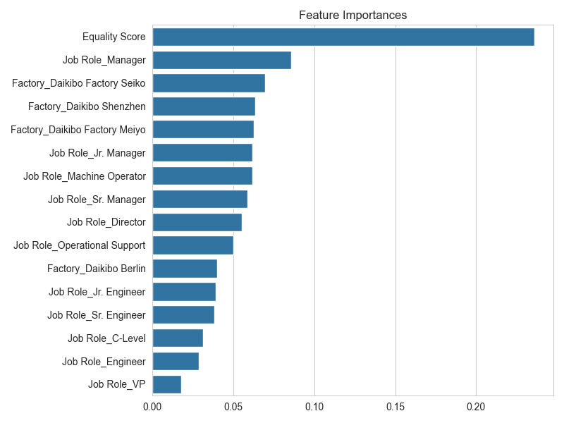
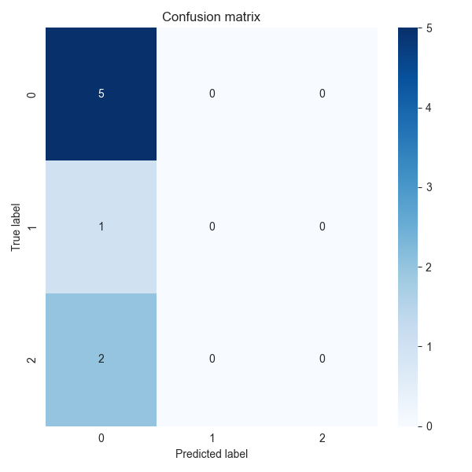

# Universal Analyst Model Report

**Date of Analysis:** 2025-08-16 00:19:18

**Dataset:** Task 5 Equality Table

## Step 1: Dataset Overview
- info: Metadata from preprocessing step

## Step 2: Exploratory Data Analysis (EDA)
# Exploratory Data Analysis Report

## Dataset Overview
- Number of rows: 37
- Number of columns: 4

## Summary Statistics
### Numerical Features
|                |   count |    mean |   median |     std |   min |   max |     skew |   kurtosis |
|:---------------|--------:|--------:|---------:|--------:|------:|------:|---------:|-----------:|
| Equality Score |      37 | -11.027 |      -10 | 9.41773 |   -26 |     4 | 0.151506 |   -1.26863 |

### Categorical Features
|                       |   unique_count |   mode_freq |   missing |
|:----------------------|---------------:|------------:|----------:|
| Factory               |              4 |          11 |         0 |
| Job Role              |             11 |           4 |         0 |
| Highly Discriminative |              3 |          20 |         0 |

## Key Insights

## Visualizations

## Step 3: Insight Extraction
# Data Insight Report

## Dataset Summary
- Number of rows: 37
- Number of columns: 4
- Target column: Highly Discriminative
- Problem type: classification

## Top Influential Features
- Job Role_Jr. Manager: Mutual Information Score = 0.1884
- Job Role_Sr. Manager: Mutual Information Score = 0.1213
- Job Role_Sr. Engineer: Mutual Information Score = 0.1051
- Job Role_Engineer: Mutual Information Score = 0.0863
- Job Role_Machine Operator: Mutual Information Score = 0.0827
- Equality Score: Mutual Information Score = 0.0685
- Job Role_Director: Mutual Information Score = 0.0677
- Job Role_Operational Support: Mutual Information Score = 0.0441
- Factory_Daikibo Factory Meiyo: Mutual Information Score = 0.0000
- Factory_Daikibo Factory Seiko: Mutual Information Score = 0.0000

## Summary Statistics of Top Features
- Equality Score: Mean = -11.0270, Median = -10.0000, Std = 9.4177

## Outlier Counts per Numeric Feature
- Equality Score: 0 outliers detected

## Next Steps
- Consider building predictive models using the identified influential features.

## Step 4: Modeling and Prediction
# Model Evaluation Report

Problem type: classification

## LogisticRegression
- accuracy: 0.8750
- precision: 0.7917
- recall: 0.8750
- f1_score: 0.8250

## RandomForestClassifier
- accuracy: 0.7500
- precision: 0.6458
- recall: 0.7500
- f1_score: 0.6932

## SVC
- accuracy: 0.6250
- precision: 0.3906
- recall: 0.6250
- f1_score: 0.4808

## Conclusion
This report summarizes the data ingestion, preprocessing, exploratory analysis, insights, and modeling results.
Further analysis and model tuning may be required based on business needs.
