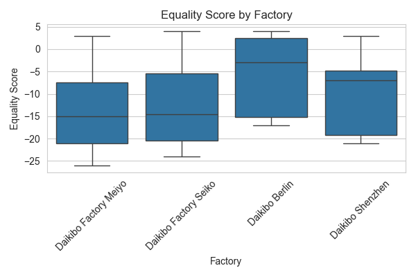
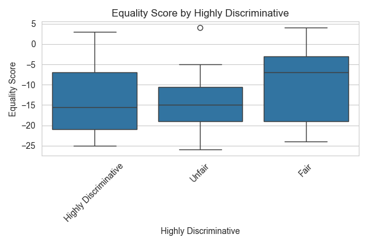
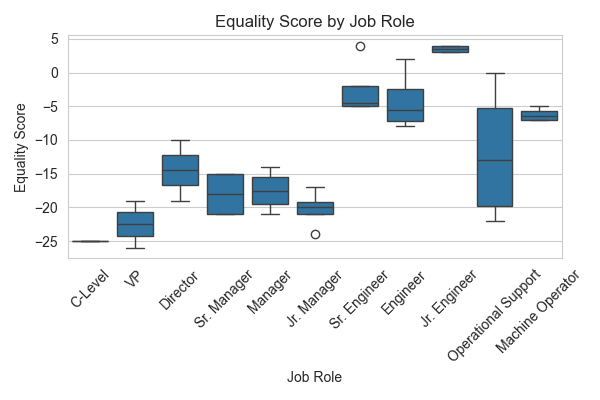
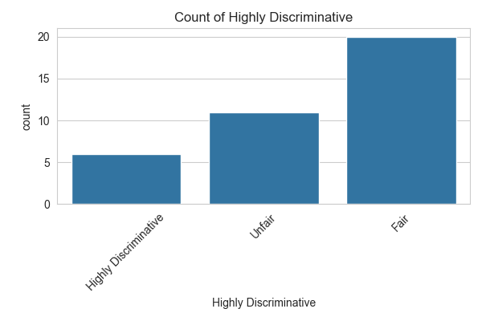
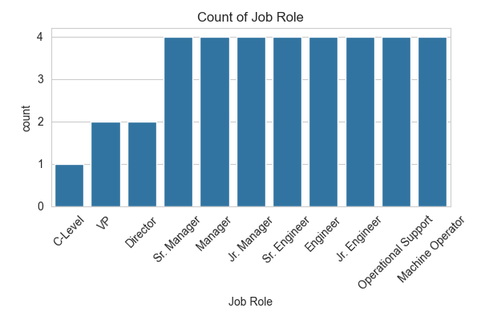
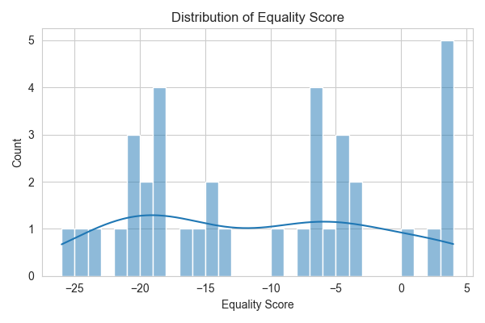

# Exploratory Data Analysis Report

## Dataset Overview
- Number of rows: 37
- Number of columns: 4

## Summary Statistics
### Numerical Features
|                |   count |    mean |   median |     std |   min |   max |     skew |   kurtosis |
|:---------------|--------:|--------:|---------:|--------:|------:|------:|---------:|-----------:|
| Equality Score |      37 | -11.027 |      -10 | 9.41773 |   -26 |     4 | 0.151506 |   -1.26863 |

### Categorical Features
|                       |   unique_count |   mode_freq |   missing |
|:----------------------|---------------:|------------:|----------:|
| Factory               |              4 |          11 |         0 |
| Job Role              |             11 |           4 |         0 |
| Highly Discriminative |              3 |          20 |         0 |

## Key Insights

## Visualizations

