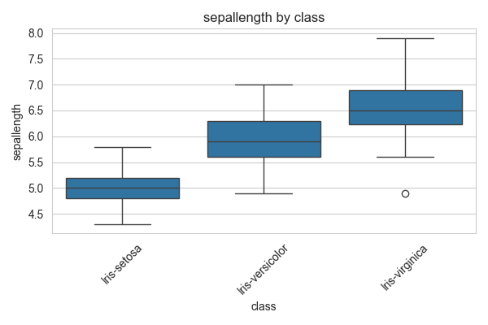
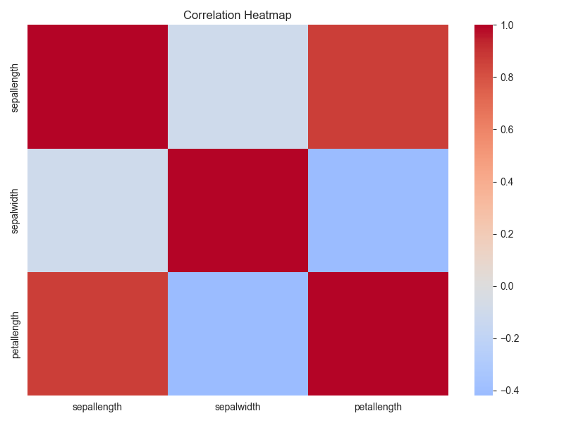
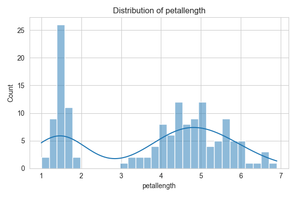
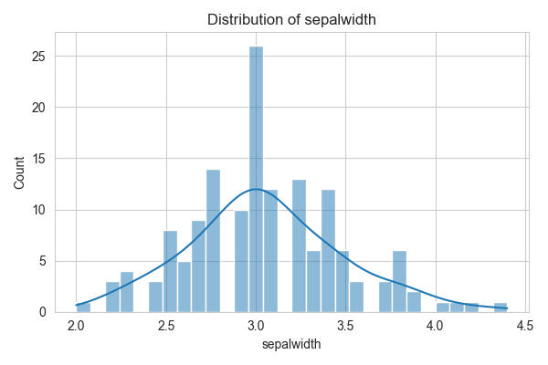
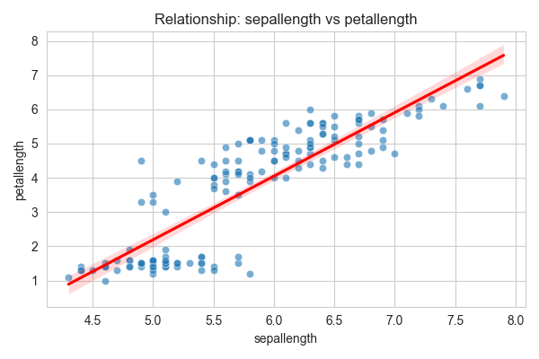
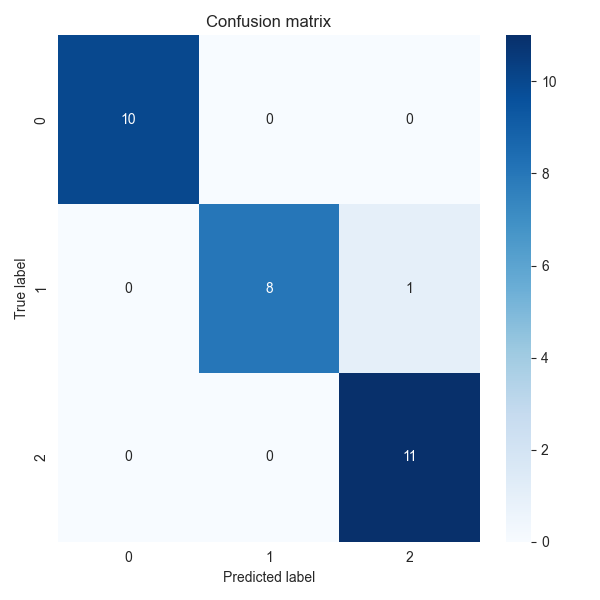
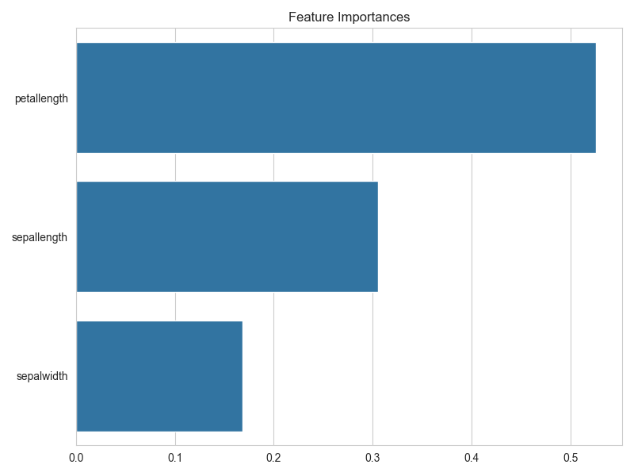
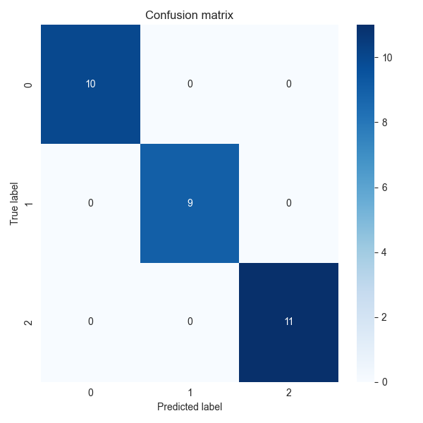

# Universal Analyst Model Report

**Date of Analysis:** 2025-08-14 00:19:29

**Dataset:** iris

## Step 1: Dataset Overview
- original_shape: (150, 5)
- final_shape: (150, 4)
- constant_columns_removed: []
- highly_correlated_columns_removed: ['petalwidth']
- columns_dropped_missing: []
- column_types: {'sepallength': 'numerical', 'sepalwidth': 'numerical', 'petallength': 'numerical', 'class': 'categorical'}
- pca_applied: False

## Step 2: Exploratory Data Analysis (EDA)
# Exploratory Data Analysis Report

## Dataset Overview
- Number of rows: 150
- Number of columns: 4

## Summary Statistics
### Numerical Features
|             |   count |    mean |   median |      std |   min |   max |      skew |   kurtosis |
|:------------|--------:|--------:|---------:|---------:|------:|------:|----------:|-----------:|
| sepallength |     150 | 5.84333 |     5.8  | 0.828066 |   4.3 |   7.9 |  0.311753 |  -0.573568 |
| sepalwidth  |     150 | 3.054   |     3    | 0.433594 |   2   |   4.4 |  0.330703 |   0.241443 |
| petallength |     150 | 3.75867 |     4.35 | 1.76442  |   1   |   6.9 | -0.271712 |  -1.39536  |

### Categorical Features
|       |   unique_count |   mode_freq |   missing |
|:------|---------------:|------------:|----------:|
| class |              3 |          50 |         0 |

## Key Insights
- Feature 'sepalwidth' has 4 potential outliers.
- Features 'sepallength' and 'petallength' have strong correlation: 0.87
- Features with high variance: petallength

## Visualizations

## Step 3: Insight Extraction
# Data Insight Report

## Dataset Summary
- Number of rows: 150
- Number of columns: 4
- Target column: class
- Problem type: classification

## Top Influential Features
- petallength: Mutual Information Score = 0.9909
- sepallength: Mutual Information Score = 0.4636
- sepalwidth: Mutual Information Score = 0.2262

## Summary Statistics of Top Features
- petallength: Mean = 3.7587, Median = 4.3500, Std = 1.7644
- sepallength: Mean = 5.8433, Median = 5.8000, Std = 0.8281
- sepalwidth: Mean = 3.0540, Median = 3.0000, Std = 0.4336

## Outlier Counts per Numeric Feature
- sepallength: 0 outliers detected
- sepalwidth: 4 outliers detected
- petallength: 0 outliers detected

## Next Steps
- Consider building predictive models using the identified influential features.

## Step 4: Modeling and Prediction
# Model Evaluation Report

Problem type: classification

## LogisticRegression
- accuracy: 1.0000
- precision: 1.0000
- recall: 1.0000
- f1_score: 1.0000

## RandomForestClassifier
- accuracy: 0.9667
- precision: 0.9694
- recall: 0.9667
- f1_score: 0.9664

## SVC
- accuracy: 1.0000
- precision: 1.0000
- recall: 1.0000
- f1_score: 1.0000

## Conclusion
This report summarizes the data ingestion, preprocessing, exploratory analysis, insights, and modeling results.
Further analysis and model tuning may be required based on business needs.
